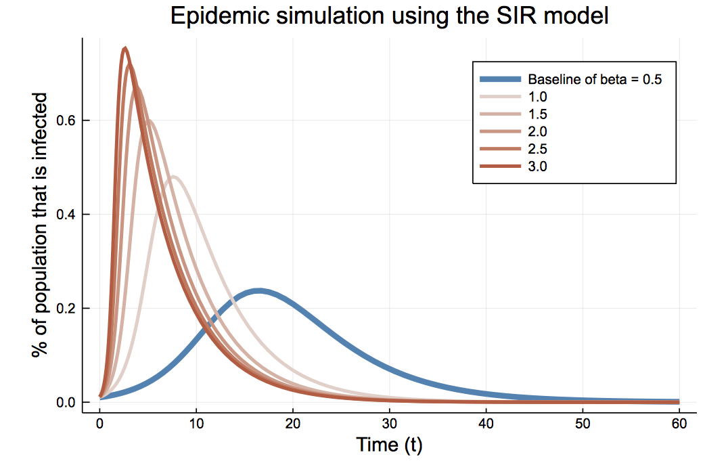

# Epidemic modeling using various fully-mixed compartmental models such as the SIR, SIS and SIRS models in Julia

#### These are traditional models that assumes a fully mixed population and therefore of lower fidelity compared to more modern techniques. However these models are helpful in providing a general understanding of how diseases spread.

#### Ref: "Networks" by Mark Newman, Print ISBN-13: 9780198805090

@copyright Dr. Srijith Rajamohan under the Creative Commons Attribution license CC BY 4.0
(Rights given to reproduce this as desired under the license agreement listed)

